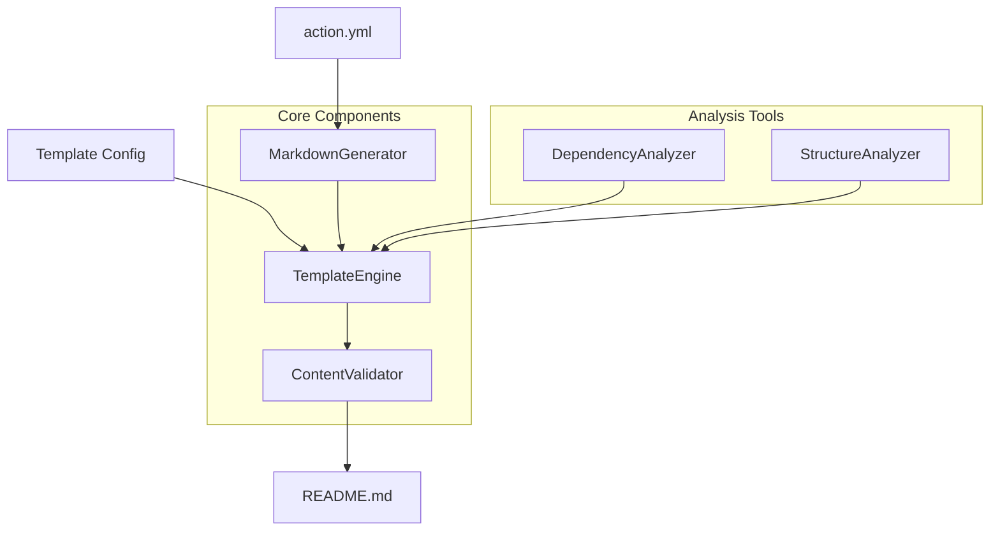

# Update Action README Generator

> **Advanced GitHub Action Documentation Generator with Template Engine,
> Dependency Analysis, and Validation**

[](https://opensource.org/licenses/Apache-2.0)
[](https://www.typescriptlang.org/)
[](https://nodejs.org/)
[](https://jestjs.io/)
[](https://eslint.org/)

A powerful, extensible GitHub Action that automatically generates comprehensive
README documentation from `action.yml` files with advanced features including
customizable templates, dependency analysis, project structure documentation,
and content validation.

## 🌟 Key Features

### 🎨 Template Engine

- **Handlebars-like Syntax**: Use `{{variables}}`, `{{#if}}`, `{{#each}}` for
  dynamic content
- **Configurable Templates**: Support for `.yml`, `.yaml`, and `.json` template
  configurations
- **Special Functions**: Built-in support for dependency graphs, project
  structure, and directory trees
- **Backward Compatibility**: Works seamlessly with existing action
  configurations

### 📊 Dependency Analysis

- **Mermaid Diagrams**: Automatic generation of dependency relationship
  visualizations
- **Package.json Analysis**: Comprehensive analysis of project dependencies
- **File Dependencies**: Cross-file dependency tracking and analysis
- **Multiple Formats**: Support for various diagram types and configurations

### 🗂️ Project Structure Documentation

- **Intelligent Analysis**: Automatic detection of file types and languages
- **Statistics Generation**: Comprehensive project metrics and insights
- **Directory Trees**: Beautiful ASCII directory structure visualization
- **Exclusion Patterns**: Configurable file and directory filtering

### ✅ Content Validation

- **Markdown Syntax**: Comprehensive validation of markdown formatting
- **Link Checking**: Internal and external link validation
- **Mermaid Diagrams**: Syntax validation for embedded diagrams
- **Custom Rules**: Extensible validation framework with custom rule support

## 🚀 Quick Start

### Basic Usage

```yaml
name: Update README
on:
  push:
    branches: [main]
    paths: ['action.yml']

jobs:
  update-readme:
    runs-on: ubuntu-latest
    steps:
      - uses: actions/checkout@v4
      - uses: coderrob/update-action-readme@v2
        with:
          token: ${{ secrets.GITHUB_TOKEN }}
```

### Advanced Template-Based Generation

```yaml
- uses: coderrob/update-action-readme@v2
  with:
    token: ${{ secrets.GITHUB_TOKEN }}
    template-config: '.github/readme-template.yml'
    enable-validation: true
    include-dependency-graph: true
    include-project-structure: true
```

## 📝 Template Configuration

Create a `.github/readme-template.yml` file to customize your README generation:

```yaml
# Template Configuration Example
sections:
  - name: header
    enabled: true
    order: 1
    template: |
      # {{action.name}}

      {{action.description}}

      ## Features
      {{#each action.inputs}}
      - **{{@key}}**: {{description}}
      {{/each}}

  - name: dependency-graph
    enabled: true
    order: 2
    template: |
      ## Project Dependencies

      {{dependency_graph type="mermaid" direction="TD"}}

  - name: project-structure
    enabled: true
    order: 3
    template: |
      ## Project Structure

      {{project_structure depth=3 show_files=true}}

variables:
  project_name: 'My Action'
  author: 'Your Name'
  version: '1.0.0'

formatting:
  line_length: 80
  use_tables: true
  include_toc: false
```

## 🏗️ Architecture

### System Overview



### Key Components

| Component              | Purpose                    | Features                                       |
| ---------------------- | -------------------------- | ---------------------------------------------- |
| **MarkdownGenerator**  | Core orchestration         | Template integration, backward compatibility   |
| **TemplateEngine**     | Dynamic content generation | Handlebars-like syntax, variable substitution  |
| **ContentValidator**   | Quality assurance          | Syntax checking, link validation, custom rules |
| **DependencyAnalyzer** | Dependency insights        | Mermaid diagrams, package analysis             |
| **StructureAnalyzer**  | Project documentation      | File analysis, directory trees, statistics     |

## 📚 API Reference

### Core Classes

#### MarkdownGenerator

```typescript
class MarkdownGenerator {
  constructor(action: Action, repository?: string);

  // Generate README using traditional renderers
  generate(): Promise<string>;

  // Generate README using template configuration
  generateFromTemplate(templatePath?: string): Promise<string>;

  // Validate generated content
  validateContent(content: string, config?: ValidationConfig): ValidationReport;
}
```

#### TemplateEngine

```typescript
class TemplateEngine {
  constructor(context: TemplateContext, config: TemplateConfig);

  // Process template with context
  process(template: string): string;

  // Render complete document
  render(): string;

  // Validate output
  validateContent(content: string): ValidationReport;
}
```

#### ContentValidator

```typescript
class ContentValidator {
  constructor(config: ValidationConfig);

  // Validate markdown content
  validateContent(content: string, filePath: string): ValidationReport;

  // Validate single file
  validateFile(filePath: string): ValidationReport;

  // Validate project documentation
  validateProject(projectPath: string): ValidationReport;
}
```

### Template Functions

#### Built-in Functions

```handlebars
{{! Dependency graph generation }}
{{dependency_graph type='mermaid' direction='LR'}}

{{! Project structure with options }}
{{project_structure depth=2 show_files=true exclude='node_modules,dist'}}

{{! Directory tree visualization }}
{{directory_tree max_depth=3 show_hidden=false}}

{{! Conditional content }}
{{#if action.branding}}
  ## Branding Color:
  {{action.branding.color}}
{{/if}}

{{! Loop through collections }}
{{#each action.inputs}}
  - **{{@key}}**:
  {{description}}
{{/each}}
```

## 🛠️ Development

### Prerequisites

- **Node.js 20+**: For runtime environment
- **TypeScript 5.0+**: For type safety and modern features
- **Jest**: For comprehensive testing
- **ESLint + Prettier**: For code quality and formatting

### Setup

```bash
# Clone the repository
git clone https://github.com/coderrob/update-action-readme.git
cd update-action-readme

# Install dependencies
npm install

# Run tests
npm test

# Run linting
npm run lint

# Build the project
npm run build

# Package for distribution
npm run package
```

### Project Structure

```
update-readme/
├── 📁 .github/          # GitHub workflows and templates
├── 📁 src/              # Source code
│   ├── 📁 markdown/     # Template engine and renderers
│   │   ├── template-engine.ts
│   │   ├── template-config.ts
│   │   └── 📁 renderers/
│   ├── 📁 schema/       # Action schema validation
│   ├── 📁 utils/        # Utility classes
│   │   ├── content-validator.ts
│   │   ├── dependency-analyzer.ts
│   │   └── structure-analyzer.ts
│   └── 📄 action.ts     # Main entry point
├── 📁 __mocks__/        # Test mocks
├── 📄 action.yml        # Action definition
├── 📄 package.json      # Dependencies and scripts
└── 📄 README.md         # This file
```

### Testing Strategy

- **Unit Tests**: Individual component testing with Jest
- **Integration Tests**: Cross-component functionality testing
- **Validation Tests**: Content quality and format verification
- **Template Tests**: Template engine and configuration testing

### Code Quality

- **TypeScript Strict Mode**: Enhanced type safety
- **ESLint Configuration**: Comprehensive code analysis
- **Prettier Formatting**: Consistent code style
- **Jest Coverage**: Minimum 85% code coverage requirement

## 🔧 Configuration Options

### Action Inputs

| Input                       | Description                         | Required | Default |
| --------------------------- | ----------------------------------- | -------- | ------- |
| `token`                     | GitHub token for repository access  | Yes      | -       |
| `template-config`           | Path to template configuration file | No       | -       |
| `enable-validation`         | Enable content validation           | No       | `true`  |
| `include-dependency-graph`  | Include dependency analysis         | No       | `false` |
| `include-project-structure` | Include project structure           | No       | `false` |
| `validation-config`         | Custom validation configuration     | No       | -       |

### Validation Configuration

```typescript
interface ValidationConfig {
  checkMarkdownSyntax: boolean; // Validate markdown formatting
  checkMermaidDiagrams: boolean; // Validate diagram syntax
  checkInternalLinks: boolean; // Verify internal link targets
  checkExternalLinks: boolean; // Validate external URLs
  checkCodeBlocks: boolean; // Ensure code block formatting
  validateYamlFrontmatter: boolean; // Check YAML front matter
  enforceStructure: boolean; // Enforce README structure
  customRules: ValidationRule[]; // Custom validation rules
}
```

## 📈 Performance & Scalability

### Optimization Features

- **Incremental Analysis**: Only analyze changed dependencies
- **Caching Strategy**: Template and analysis result caching
- **Async Processing**: Non-blocking I/O operations
- **Memory Management**: Efficient large file handling
- **Parallel Validation**: Multi-threaded content validation

### Benchmarks

| Operation           | Small Project | Medium Project | Large Project |
| ------------------- | ------------- | -------------- | ------------- |
| Basic Generation    | <1s           | 2-3s           | 5-8s          |
| Template Processing | <2s           | 3-5s           | 8-12s         |
| Dependency Analysis | <3s           | 5-10s          | 15-25s        |
| Full Validation     | <2s           | 4-8s           | 10-18s        |

## 🤝 Contributing

We welcome contributions! Please see our
[Contributing Guidelines](CONTRIBUTING.md) for details.

### Development Workflow

1. **Fork** the repository
2. **Create** a feature branch: `git checkout -b feature/amazing-feature`
3. **Commit** your changes: `git commit -m 'Add amazing feature'`
4. **Push** to the branch: `git push origin feature/amazing-feature`
5. **Open** a Pull Request

### Code Standards

- Follow TypeScript best practices
- Maintain test coverage above 85%
- Use conventional commit messages
- Update documentation for new features

## 📄 License

This project is licensed under the **Apache License 2.0** - see the
[LICENSE](LICENSE) file for details.

## 🏆 Acknowledgments

- **GitHub Actions Team**: For the excellent platform and APIs
- **TypeScript Community**: For the robust type system
- **Jest Testing Framework**: For comprehensive testing capabilities
- **Mermaid**: For beautiful diagram generation
- **All Contributors**: Who help make this project better

## 🔗 Related Projects

- [actions/checkout](https://github.com/actions/checkout) - Repository checkout
  action
- [actions/setup-node](https://github.com/actions/setup-node) - Node.js setup
  action
- [peaceiris/actions-gh-pages](https://github.com/peaceiris/actions-gh-pages) -
  GitHub Pages deployment

---

<div align="center">

**Made with ❤️ by the GitHub Actions Community**

[Documentation](https://docs.github.com/en/actions) |
[Examples](https://github.com/coderrob/update-action-readme/tree/main/examples)
| [Support](https://github.com/coderrob/update-action-readme/issues)

</div>
